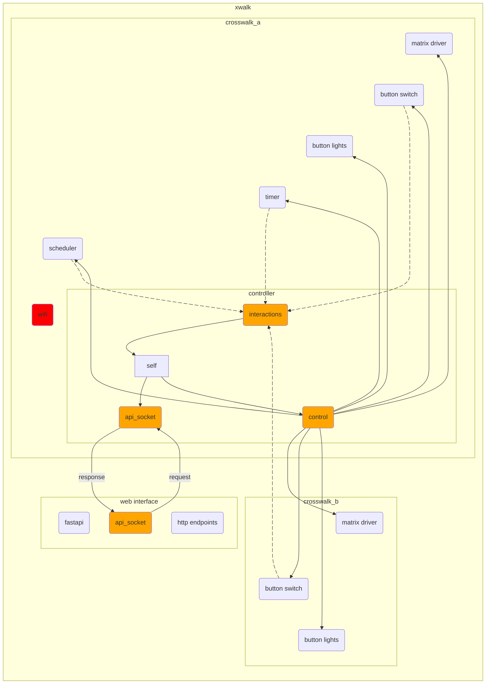

# Crosswalk V2

The Python-based control system for managing Crosswalk, an interactive art project that mimics a real push-button-to-cross crosswalk, but that tells you to do much more than walk. It uses ZMQ for communication and runs animations on LED matrix displays.

## Requirements

- Python 3.13 or higher
- pyzmq >= 26.4.0
- pydantic >= 2.0.0

## Installation

Make sure [git-lfs](https://git-lfs.com/) is installed! Assets are stored there.

### To an RPI

We use anisble playboks to deploy to the RPI.

`cd anisble`
`uv run ansible-playbook site.yml -i inventory.ini`

You can start at a specific step by using:
`uv run ansible-playbook site.yml -i inventory.ini --start-at-task "Install xwalk service files"`

Each component is run as a separate systemd service, all prefixed with `xwalk_`.

Some useful commands:

- `journalctl -f --unit  xwalk_button_switch.service`
- `systemctl stop xwalk_*` stop all xwalk services
- `systemctl status xwalk_*` get xwalk status
- `systemctl restart xwalk_*` restart all xwalk services

### The Normal Way

1. <https://docs.astral.sh/uv/getting-started/installation/> (a Python package and project manager):
2. To run a command:

    ```bash
    uv run -m xwalk2.controller
    ```

### The Nix Way

To get started:

1. Install [Nix](https://nixos.org/download.html) if you haven't already
2. Run the following command in the project directory:

   ```bash
   nix develop
   ```

   This will drop you into a development shell with all dependencies installed.

## Running the Program

### Making sure it works

After installation, make sure you're in the project root directory and run the controller:

```bash
uv run xwalk2/controller.py
```

You should see output similar to this:

```
Starting Crosswalk V2 Controller...
Initializing ZMQ sockets...
ZMQ sockets initialized successfully
Listening on ports:
  - 5556: Interactions
  - 5557: Control
  - 5558: Heartbeats
  - 5559: API Requests

Controller is running. Press Ctrl+C to exit.
Waiting for components to connect...
```

To stop the program, press Ctrl+C.

### Example usage

To test the system, you'll need to run multiple components in separate terminal windows:

#### Terminal 1: Start the Controller

```bash
uv run xwalk2/controller.py
```

You should see:

```
Starting Crosswalk V2 Controller...
Listening on ports:
  - 5556: Interactions
  - 5557: Control  
  - 5558: Heartbeats
  - 5559: API Requests
Controller is running. Press Ctrl+C to exit.
```

#### Terminal 2: Start the Button Switch (Console Mode)

```bash
uv run xwalk2/button_switch.py -m console
```

This allows you to simulate button presses by pressing Enter twice (once for press, once for release).

#### Terminal 3: Start the Web API (Optional)

```bash
uv run xwalk2/api.py
```

The web interface will be available at `http://localhost:8000` with a control panel for testing.

## Project Structure

- `xwalk2/` - Main package directory
  - `animation.py` - Animation system implementation
  - `api.py` - Web API interface
  - `button_lights.py` - Button lighting control
  - `button_switch.py` - Button switch handling
  - `controller.py` - Main controller logic
  - `matrix_driver.py` - Matrix display driver
  - `models.py` - Data models
  - `timer.py` - Timing utilities
  - `util.py` - Utility functions

## Architecture

At a high level there, one crosswalk box will host the controller which has three [0MQ](https://zeromq.org/) sockets:

- **Interactions**: Receives events (from button switch, timer, and scheduler) that will eventually trigger something to happen on the boxes. The controller is regularly polling Interactions then taking actions with the events it finds.
- **Control**: Receives events from the controller which are broadcast out to all subscribed components. Events will be things like "turn the button light off", "matrix driver, display this gif", etc.
- **API**: Handles HTTP API requests for system status and triggering actions, served through a FastAPI web interface.

Note that one goal is to have the ability to restart all components, so even components like button press that seem like they will only emit events are still subscribed to the Control socket so they can be reset.



## Development

The project uses modern Python tooling:

- `pyproject.toml` for project configuration and dependencies
- `flake.nix` for Nix development environment
- `uv.lock` for dependency locking

## Handy Commands

`identify -format "%n %T\n" /opt/crosswalk/img/walks/walk-backwards.gif`

`led-image-viewer --led-cols=64 --led-chain=2 --led-gpio-mapping=adafruit-hat-pwm --led-pwm-lsb-nanoseconds=400 --led-pixel-mapper "U-mapper;Rotate:90" --led-no-drop-privs -l 1 countdown5.gif -Ocountdown5.stream`

`led-image-viewer  --led-cols=64 --led-chain=2 --led-gpio-mapping=adafruit-hat-pwm --led-pwm-lsb-nanoseconds=400 --led-pixel-mapper "U-mapper;Rotate:90" -l 1 wait6.stream`

`led-image-viewer --led-cols=64 --led-chain=2 --led-gpio-mapping=adafruit-hat-pwm --led-slowdown-gpio=2 --led-pixel-mapper "U-mapper;Rotate:90" --led-show-refresh /opt/crosswalk/test/data/img/stop.gif`

Generate a lock file on the RPI: `uv sync --no-dev`
